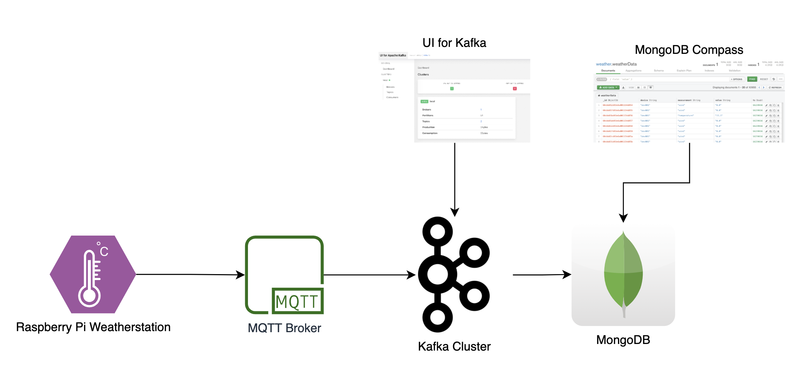
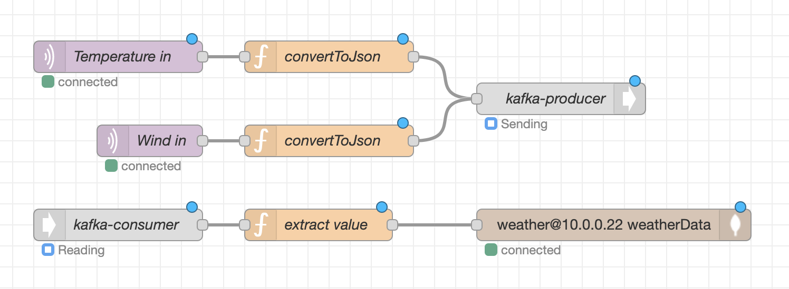
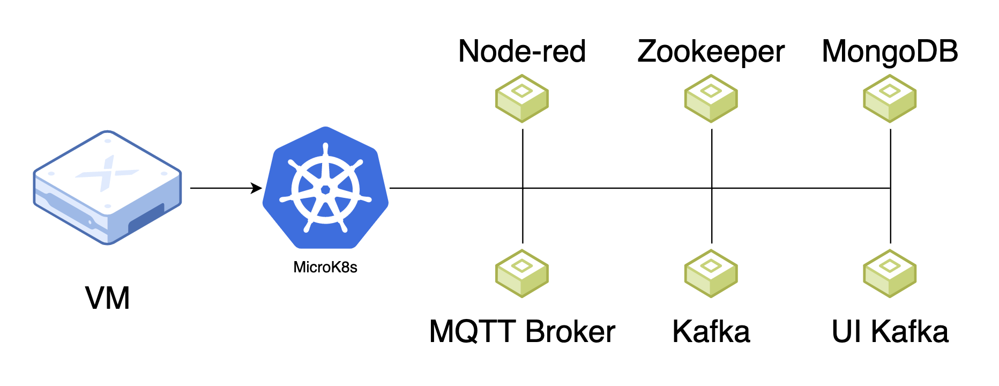
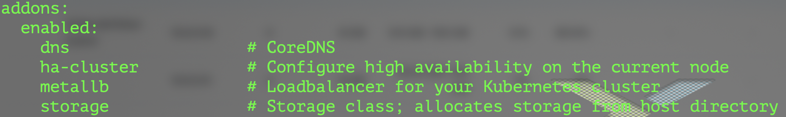
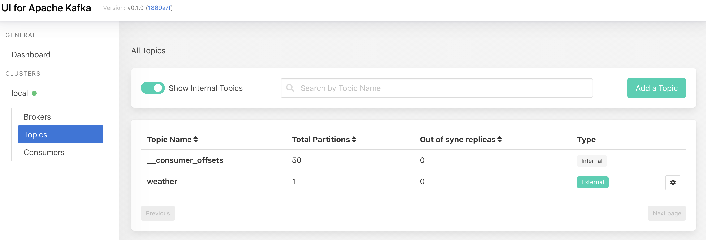

# Playing with Kafka and K8s

I wanted to play around with Kafka, an what better way to deploy Kafka then using Kubernetes.

## Overview

I put together a simple pipeline to collect and store data from my Raspberry Pi based weatherstation.



The weatherstation sends data to a MQTT broker. A Kafka producer is then pushing that data to a Kafka Topic. A Kafka consumer then reads the data from the topic and inputs it to MongoDB.

To gain insights in the process, I use a tool called UI for Kafka (https://github.com/provectus/kafka-ui/) and MongoDB Compass (https://www.mongodb.com/products/compass).

To build the pipeline I use Node-red (https://nodered.org/).


The infrastructure consists of a VM with MicroK8s as the Kubernetes distribution. The rest of the components run as Pods on that cluster.


## Here are the steps I whent through

### Infrastructure

I deployed an Ubuntu VM and used SNAP to install MicroK8s. I then enabled 

```bash
dns
metallb
storage
```



### Kubernetes deployments

I deployed all of the used services within the Microk8s kubetnetes cluster.
Everything is deployed to the same namespace.

```bash
kubectl apply -f <path to file>
```

#### Namespace

[1_namespace.yaml](1_namespace.yaml)

#### Node-red

* Todo

#### Zookeeper

[2_zookeeperDeployment.yaml](2_zookeeperDeployment.yaml)  
[3_zookeeperService.yaml](3_zookeeperService.yaml)

#### Kafka

With kafka, I started with the service, I then fetched the external IP for the kafka service and added it to the 5_kafkaDeployment.yaml file, before deploying it.

```bash
kubectl get service -n kafka-cluster
```

[4_KafkaService.yaml](4_KafkaService.yaml)  
[5_KafkaDeployment.yaml](5_KafkaDeployment.yaml)

#### Kafka UI

[6_kafkaUIDeployment.yaml](6_kafkaUIDeployment.yaml)

Once Kafka UI is deployed use

```bash
kubectl get service -n kafka-cluster
```

To get the external IP of the Kafak UI.

#### MQTT

* [7_mqttDeployment.yaml](7_mqttDeployment.yaml)

### Kafka

I used Kafka UI to create a kafka topic.


### Node-red

I used Node-red to tie the pipeline together.

